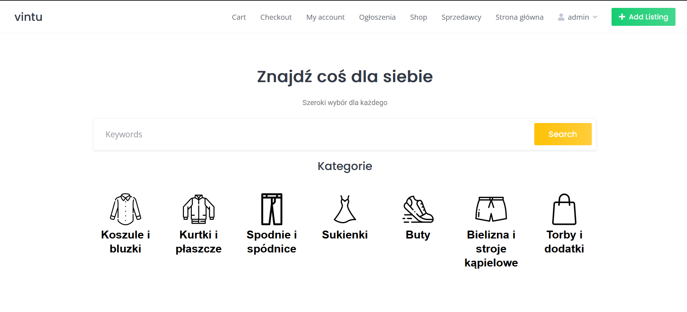
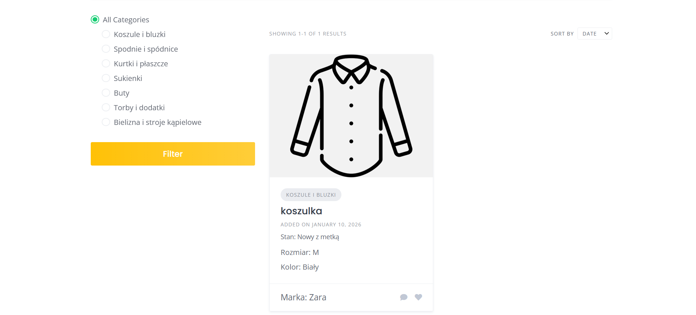
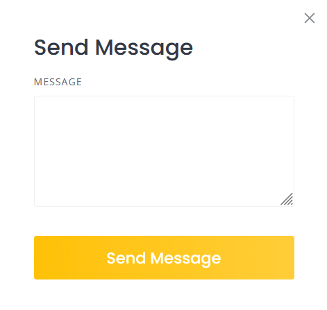
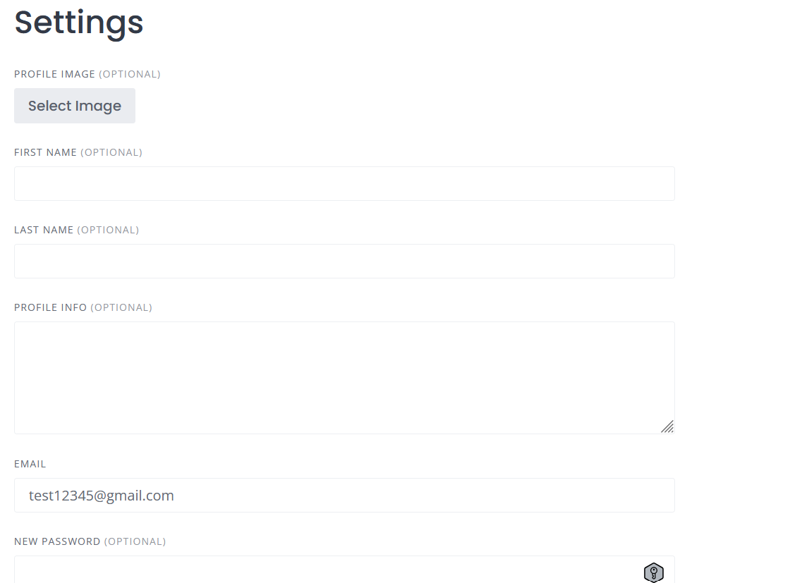

# wordpress-listing-app
Projekt aplikacji ogłoszeniowej zbudowany w WordPress z użyciem HivePress i WooCommerce

## 🚀 Funkcjonalności
- dodawanie ogłoszeń przez użytkowników
- profile użytkowników
- filtrowanie i wyszukiwanie ofert
- kategorie produktów
- system wiadomości między użytkownikami
- panel użytkownika (zarządzanie profilem i ogłoszeniami)
- pakiety premium (wyróznianie ogłoszeń i możliwość wsytawienia większej liczby ogłoszeń)

## 🛠 Technologie
- WordPress
- HivePress
- ListingHive
- WooCommerce
- JavaScript

## 💡 Co zrobiłem
- konfiguracja systemu ogłoszeń
- dostosowanie struktury strony
- customizacja wyglądu 
- konfiguracja funkcji marketplace
- implementacja podstawowych elementów e-commerce

## 📸 Screenshots
### 🏠 Strona główna

 

### 📂 Kategorie

 

### 📦 Lista ogłoszeń

### 📝 Dodawanie ogłoszenia

### 👤 Rejestracja

### 💬 Wiadomości

### ⚙️ Ustawienia

